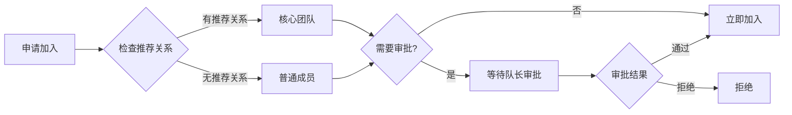
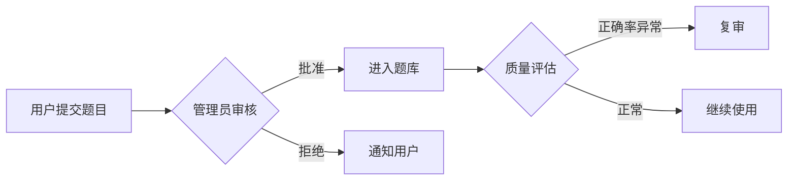

# 需求文档 v2.0

**项目名称**: RWA社交裂变游戏化平台
**版本**: v2.0 (游戏化升级)
**编写日期**: 2025-10-21
**状态**: 需求调研完成 ✅

---

## 📋 目录

1. [项目概述](#项目概述)
2. [业务目标](#业务目标)
3. [功能需求](#功能需求)
4. [技术需求](#技术需求)
5. [交付标准](#交付标准)
6. [里程碑计划](#里程碑计划)

---

## 🎯 项目概述

### 背景

v1.0已实现基础推荐系统，包含：
- ✅ 推荐人绑定（链上）
- ✅ 两级推荐奖励（BNB直接发放）
- ✅ 推荐仪表板
- ✅ 排行榜

### v2.0升级方向

从**纯推荐系统**升级到**游戏化社交平台**，新增4大模块：

| 模块 | 核心价值 | 优先级 |
|------|---------|-------|
| 💎 **积分系统** | 统一奖励货币 | P0 |
| ⚔️ **战队系统** | 团队协作 | P1 |
| 📋 **任务系统** | 持续激励 | P1 |
| 🎯 **问答系统** | 知识传播 | P2 |

### 核心变化

```diff
- 推荐奖励：直接发放BNB
+ 推荐奖励：发放积分 (预留代币兑换接口)

- 单人奖励模式
+ 团队奖励池模式 (战队)

- 被动等待推荐
+ 主动完成任务获取积分

- 无留存机制
+ 每日签到/答题增强黏性
```

---

## 💼 业务目标

### 核心指标 (KPI)

| 指标 | 当前 (v1.0) | 目标 (v2.0) | 提升 |
|------|------------|-----------|-----|
| **日活用户 (DAU)** | 500 | 2000 | 4x |
| **用户留存 (D7)** | 15% | 40% | 2.67x |
| **推荐转化率** | 5% | 12% | 2.4x |
| **人均使用时长** | 3min | 15min | 5x |
| **战队参与率** | 0% | 60% | NEW |

### 业务价值

1. **提升留存**: 每日任务+签到 → 养成习惯
2. **增强活跃**: 战队竞争 → 社交裂变
3. **降低成本**: 积分代替BNB → 控制奖励成本
4. **品牌传播**: 答题系统 → Web3知识普及

---

## ⚙️ 功能需求

### 模块1: 💎 积分系统 (P0 - 必须优先)

#### 1.1 核心需求

**FR-PT-001: 积分账户**
- 每个用户拥有唯一积分账户
- 积分类型：
  - `available_points`: 可用积分
  - `frozen_points`: 冻结积分（用于提现审核）
- 积分来源统计：
  - 推荐奖励
  - 任务奖励
  - 答题奖励
  - 战队奖励
  - 购买奖励

**FR-PT-002: 积分流水**
- 所有积分变动必须记录
- 流水字段：
  - 交易类型 (枚举)
  - 变动金额 (正/负)
  - 交易后余额
  - 关联对象 (任务/用户/战队/题目)
  - 时间戳

**FR-PT-003: 积分获取规则**

| 行为 | 积分奖励 | 频率限制 |
|------|---------|---------|
| 每日签到 | +10 | 每天1次 |
| 邀请好友 | +100 | 无限制 |
| 购买产品 | +动态 | 无限制 |
| 社交分享 | +20 | 每天3次 |
| 连续登录7天 | +50 | 每7天1次 |
| 战队任务 | +动态 | 根据任务 |
| 答题正确(简单) | +5 | 每天5题 |
| 答题正确(中等) | +10 | 每天5题 |
| 答题正确(困难) | +20 | 每天5题 |
| 一级推荐奖励 | +150 | 无限制 |
| 二级推荐奖励 | +50 | 无限制 |

**FR-PT-004: 积分兑换 (预留接口)**
- 积分与BNB无关
- 预留积分兑换代币接口：
  ```typescript
  interface TokenExchangeRequest {
    user_id: number;
    points_amount: number;
    token_address: string;
    exchange_rate: number;  // 动态获取
  }
  ```

#### 1.2 非功能需求

- **NFR-PT-001**: 积分变动延迟 < 500ms
- **NFR-PT-002**: 积分流水查询支持分页（每页50条）
- **NFR-PT-003**: 支持按类型筛选积分流水

---

### 模块2: ⚔️ 战队系统 (P1 - 高优先级)

#### 2.1 核心需求

**FR-TM-001: 战队创建**
- 任何用户可创建战队
- 战队信息：
  - 战队名称（唯一，3-20字符）
  - 战队描述（200字以内）
  - 战队Logo（URL）
  - 队长（creator）
- 无人数上限

**FR-TM-002: 战队角色**

| 角色 | 权限 | 限制 |
|------|------|------|
| **队长 (Captain)** | 解散战队、任免管理员、踢人 | 1人 |
| **管理员 (Admin)** | 审批成员、发布任务 | ≤5人 |
| **会员 (Member)** | 参与任务、获得奖励 | 无限制 |

**FR-TM-003: 战队成员要求** ⚠️ 重要约束
- **核心团队成员**（享受奖励池）：
  - ✅ 必须与队长有推荐关系
  - ✅ 在同一个推荐树上
  - ✅ 参与奖励池分配
- **普通成员**（不享受奖励池）：
  - ✅ 无推荐关系要求
  - ✅ 可参与战队活动
  - ❌ 不参与奖励池分配

**FR-TM-004: 战队排行榜**

排序维度：
1. 战队总积分 (默认)
2. 战队成员数
3. 活跃成员数

显示信息：
- 排名
- 战队名称
- 队长昵称
- 成员数
- 总积分
- 等级

**FR-TM-005: 战队任务**
- 队长/管理员可创建战队任务
- 任务类型：
  - 集体邀请目标（全队邀请50人）
  - 集体购买目标（全队购买100 BNB）
  - 集体答题目标（全队答对500题）
- 完成后奖励进入战队奖励池

**FR-TM-006: 战队奖励池**

**奖励池来源**：
- 核心团队成员的购买奖励（不再直接发给推荐人）
- 战队任务完成奖励

**分配规则**：
- 每天02:00自动分配
- 按成员贡献值加权分配：
  ```
  贡献值 = 任务完成数 × 10 + 购买金额 × 100 + 邀请人数 × 50

  成员分配 = (成员贡献值 / 总贡献值) × 奖励池
  ```
- 仅分配给核心团队成员

**FR-TM-007: 加入战队流程**



#### 2.2 非功能需求

- **NFR-TM-001**: 战队排行榜查询 < 1s
- **NFR-TM-002**: 支持战队内搜索成员
- **NFR-TM-003**: 奖励池分配任务必须原子性

---

### 模块3: 📋 任务系统 (P1 - 高优先级)

#### 3.1 任务类型

**FR-TS-001: 每日任务**

| 任务名称 | 目标 | 奖励 | 重置时间 |
|---------|------|------|---------|
| 每日签到 | 点击签到 | +10积分 | 每天00:00 |
| 邀请好友 | 邀请1人 | +100积分 | 每天00:00 |
| 社交分享 | 分享3次 | +20积分/次 | 每天00:00 |

**FR-TS-002: 每周任务**

| 任务名称 | 目标 | 奖励 | 重置时间 |
|---------|------|------|---------|
| 连续登录7天 | 登录7天 | +50积分 | 每周一00:00 |
| 推荐5人 | 邀请5人 | +200积分 | 每周一00:00 |

**FR-TS-003: 一次性任务**

| 任务名称 | 目标 | 奖励 | 限制 |
|---------|------|------|------|
| 首次购买 | 购买任意金额 | +500积分 | 一次 |
| 绑定推荐人 | 绑定推荐人 | +50积分 | 一次 |
| 加入战队 | 加入任何战队 | +30积分 | 一次 |
| 创建战队 | 创建战队 | +100积分 | 一次 |

**FR-TS-004: 战队任务**
- 由队长/管理员创建
- 需要团队协作完成
- 奖励进入战队奖励池

#### 3.2 任务进度追踪

**FR-TS-005: 进度显示**
- 当前进度 / 目标值 (如: 3/10)
- 百分比进度条
- 完成状态：
  - `in_progress`: 进行中
  - `completed`: 已完成
  - `claimed`: 已领取
  - `expired`: 已过期

**FR-TS-006: 任务自动触发**
- 购买 → 自动更新购买相关任务进度
- 邀请 → 自动更新邀请任务进度
- 分享 → 手动点击"分享"按钮

**FR-TS-007: 奖励领取**
- 任务完成后不自动发放
- 用户需点击"领取奖励"
- 防止用户遗忘：完成后推送通知

#### 3.3 非功能需求

- **NFR-TS-001**: 任务进度更新延迟 < 1s
- **NFR-TS-002**: 支持任务完成通知（WebSocket/长轮询）
- **NFR-TS-003**: 每日00:00任务刷新不阻塞系统

---

### 模块4: 🎯 问答系统 (P2 - 中优先级)

#### 4.1 核心需求

**FR-QZ-001: 题库管理**

**题库来源**：
1. 管理员手动添加
2. 用户提交（需审核）
3. 第三方API（如: Trivia API）

**题目结构**：
```typescript
interface Question {
  id: number;
  question_text: string;
  option_a: string;
  option_b: string;
  option_c?: string;
  option_d?: string;
  correct_answer: 'A' | 'B' | 'C' | 'D';
  difficulty: 'easy' | 'medium' | 'hard';
  category: string;  // Web3/DeFi/NFT/区块链基础
  reward_points: number;
}
```

**FR-QZ-002: 答题规则**
- 每天限制5道题
- 随机抽取题目（按难度加权）
- 答题时间限制：30秒/题
- 超时视为答错
- 答错不扣分

**FR-QZ-003: 答题奖励**

| 难度 | 奖励积分 | 抽取概率 |
|------|---------|---------|
| 简单 (easy) | +5 | 60% |
| 中等 (medium) | +10 | 30% |
| 困难 (hard) | +20 | 10% |

**FR-QZ-004: 题目审核流程**



质量评估标准：
- 正确率 > 90%：可能过于简单，调整难度
- 正确率 < 10%：可能有错误，复审题目
- 举报数 > 10：下线题目

**FR-QZ-005: 答题排行榜**

排序维度：
1. 总答对数（默认）
2. 正确率
3. 答题总数

显示信息：
- 排名
- 用户昵称
- 总答题数
- 正确答题数
- 正确率

**FR-QZ-006: 答题记录**
- 用户可查看历史答题记录
- 显示：题目、用户答案、正确答案、耗时
- 支持按时间/正确性筛选

#### 4.2 非功能需求

- **NFR-QZ-001**: 题目加载 < 500ms
- **NFR-QZ-002**: 答题计时精确到秒
- **NFR-QZ-003**: 支持题目举报功能

---

## 🛠️ 技术需求

### 系统架构

**TNR-001: 三层架构**
```
前端 (React 18 + TypeScript)
    ↓ HTTPS/WebSocket
后端 (FastAPI + PostgreSQL + Redis)
    ↓ JSON-RPC
智能合约 (Solidity 0.8.19 + Hardhat)
```

### 数据库要求

**TNR-002: PostgreSQL 15**
- 表设计参见 [DATABASE_SCHEMA.md](./DATABASE_SCHEMA.md)
- 必须实现表：
  - ✅ users
  - ✅ user_points
  - ✅ point_transactions
  - ✅ teams
  - ✅ team_members
  - ✅ tasks
  - ✅ user_tasks
  - ✅ questions
  - ✅ user_answers

**TNR-003: Redis 7**
- 缓存排行榜（Sorted Set）
- 存储用户会话
- 任务状态缓存
- API限流

### 智能合约改造

**TNR-004: RWAReferral.sol 改造**

```solidity
// 改动1: 将BNB奖励改为积分（链下）
// 删除：triggerReward() 中的转账逻辑
// 改为：发送事件，由后端监听并发放积分

event RewardCalculated(
    address indexed from,
    address indexed referrer,
    uint256 pointsAmount,
    uint256 level
);

// 改动2: 新增推荐树查询
function getReferralTree(address user)
    external
    view
    returns (address[] memory);
```

### API设计

**TNR-005: RESTful API**

新增端点：

**积分系统**:
- `GET /api/v1/points/{user_id}` - 查询积分
- `GET /api/v1/points/transactions` - 积分流水
- `POST /api/v1/points/exchange` - 兑换代币（预留）

**战队系统**:
- `POST /api/v1/teams` - 创建战队
- `GET /api/v1/teams/{team_id}` - 战队详情
- `POST /api/v1/teams/{team_id}/join` - 加入战队
- `POST /api/v1/teams/{team_id}/leave` - 离开战队
- `GET /api/v1/teams/leaderboard` - 战队排行榜
- `GET /api/v1/teams/{team_id}/members` - 成员列表
- `POST /api/v1/teams/{team_id}/tasks` - 创建战队任务

**任务系统**:
- `GET /api/v1/tasks` - 任务列表
- `GET /api/v1/tasks/{task_id}/progress` - 任务进度
- `POST /api/v1/tasks/{task_id}/claim` - 领取奖励
- `POST /api/v1/tasks/daily/refresh` - 刷新每日任务

**问答系统**:
- `GET /api/v1/quiz/daily` - 获取今日题目
- `POST /api/v1/quiz/answer` - 提交答案
- `GET /api/v1/quiz/leaderboard` - 答题排行榜
- `POST /api/v1/quiz/questions` - 提交题目（用户）
- `GET /api/v1/quiz/history` - 答题历史

### 性能要求

**TNR-006: 响应时间**
- API响应: < 500ms (P95)
- 数据库查询: < 200ms (P95)
- 排行榜查询: < 1s

**TNR-007: 并发支持**
- 并发用户: 10,000+
- QPS: 1,000+
- WebSocket连接: 5,000+

### 安全要求

**TNR-008: 数据安全**
- 所有API使用HTTPS
- 积分操作幂等性设计
- SQL注入防护
- XSS防护

**TNR-009: 访问控制**
- JWT认证
- 钱包签名验证
- API限流 (100 req/min/user)

---

## ✅ 交付标准

### 功能完整性

**DL-001: 核心功能**
- ✅ 所有4大模块功能实现
- ✅ 积分系统100%可用
- ✅ 战队系统核心流程通畅
- ✅ 任务系统自动刷新
- ✅ 问答系统题库≥100题

### 测试覆盖率

**DL-002: 测试标准**
- 单元测试覆盖率 ≥ 80%
- E2E测试覆盖核心路径
- 智能合约测试 100%通过
- 负载测试通过 (1000 QPS)

### 性能指标

**DL-003: 性能基准**
- API P95响应时间 < 500ms
- 首屏加载时间 < 2s
- 排行榜查询 < 1s
- 数据库查询 < 200ms

### 文档完整性

**DL-004: 文档交付**
- ✅ API文档（Swagger）
- ✅ 数据库Schema文档
- ✅ 部署文档
- ✅ 用户使用手册

### 安全审计

**DL-005: 安全检查**
- ✅ 智能合约无严重漏洞
- ✅ 后端无SQL注入漏洞
- ✅ 前端无XSS漏洞
- ✅ 通过第三方安全扫描

---

## 📅 里程碑计划

### 阶段1: 需求调研 ✅ (已完成)
- ✅ 需求澄清
- ✅ 技术调研
- ✅ 架构设计
- ✅ 数据库设计
- ✅ 风险评估

**交付物**:
- ✅ REQUIREMENTS_V2.md
- ✅ DATABASE_SCHEMA.md
- ✅ RISK_ASSESSMENT.md

---

### 阶段2: 任务规划 (下一步)
- 任务拆解
- 时间估算
- 依赖关系分析
- 资源分配

**预计时间**: 1天

---

### 阶段3: 智能合约改造 (2天)
- RWAReferral.sol改造
- 事件监听服务
- 部署到测试网

---

### 阶段4: 数据库实施 (2天)
- 安装PostgreSQL 15
- 执行Schema迁移
- 数据同步脚本

---

### 阶段5: 后端开发 (5天)
- 积分系统API (1天)
- 战队系统API (2天)
- 任务系统API (1天)
- 问答系统API (1天)

---

### 阶段6: 前端开发 (5天)
- 积分中心页面 (1天)
- 战队管理页面 (2天)
- 任务中心页面 (1天)
- 答题挑战页面 (1天)

---

### 阶段7: 集成测试 (2天)
- E2E测试
- 性能测试
- 安全测试

---

### 阶段8: 部署上线 (1天)
- BSC测试网部署
- 服务器部署
- 监控配置

---

**总计预估时间**: **18天**

---

## 📞 相关文档

- [数据库Schema设计](./DATABASE_SCHEMA.md)
- [风险评估报告](./RISK_ASSESSMENT.md)
- [系统架构图](./ARCHITECTURE.md)
- [API接口文档](./API.md)

---

## ✍️ 变更记录

| 版本 | 日期 | 变更内容 | 作者 |
|------|------|---------|------|
| v2.0 | 2025-10-21 | 新增4大游戏化模块 | Ultra Builder |
| v1.0 | 2025-10-20 | 基础推荐系统 | Ultra Builder |

---

**文档状态**: ✅ 已完成，等待进入阶段2：任务规划

**下一步**: 执行 `/ultra-plan` 开始任务拆解和规划
